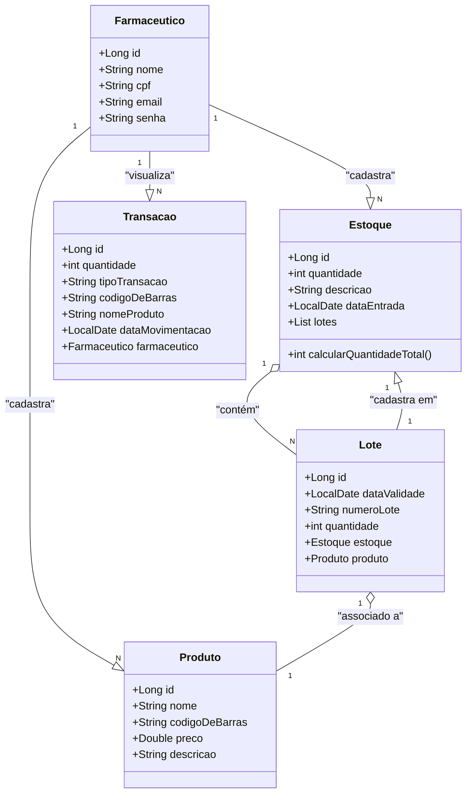

# 💊 API de Gestão Farmacêutica

   

A API de Gestão Farmacêutica tem como objetivo fornecer um conjunto de serviços RESTful para gerenciar produtos farmacêuticos, estoques e transações de forma eficiente e segura. 
Essa API foi projetada para ser utilizada por farmacêuticos e administradores de farmácias, permitindo o cadastro, visualização e gerenciamento de produtos, lotes e estoques. 
A API foi construída em Java com Spring Boot e utiliza PostgreSQL para armazenamento dos dados. Esse projeto foi construído para o bootcamp da Claro disponibilizado pela DIO. 
  

## Diagrama de classes

## 🧑‍⚕️ Recursos da API

1. Cadastro e gerenciamento de farmacêuticos.
2. Cadastro e gerenciamento de produtos efetuados somente por farmacêuticos cadastrados no sistema.
3. Cadastro e gerenciamento de estoques efetuados somente por farmacêuticos cadastrados no sistema.
4. Cadastro e gerenciamento de lotes em um estoque efetuados somente por farmacêuticos cadastrados no sistema.
5. Visualização das transações relacionadas a movimentação de estoque efetuadas por farmacêuticos.
   
## 📙 Documentação

A API inclui uma documentação integrada via Swagger, simplificando o uso dos endpoints e esclarecendo dependências entre operações, 
como a necessidade de cadastro de farmacêuticos antes de produtos e de criação de estoques antes da adição de lotes. Para mais detalhes, ao executar a aplicação acesse:
http://localhost:8080/swagger-ui/index.html

## 🤝 Contribuição

Fique à vontade para contribuir com o projeto! Você pode fazer isso abrindo uma issue ou enviar um pull request.

## 🔍 Observações

Este projeto representa a versão inicial da API de Gestão Farmacêutica. Futuras melhorias estão previstas, 
incluindo aperfeiçoamentos na documentação e a implementação de segurança com Spring Security e JWT, entre outras otimizações.

## 📝 Licença

Este projeto é licenciado sob a Licença MIT - consulte o arquivo <a href="https://github.com/BrunnoCarvalho/farmacia-api-2024/blob/main/LICENSE.md">(LICENSE)</a> para mais detalhes.

## 🧑‍💻 Contato

Desenvolvido por Bruno Vivian Carvalho. Entre em contato! 

